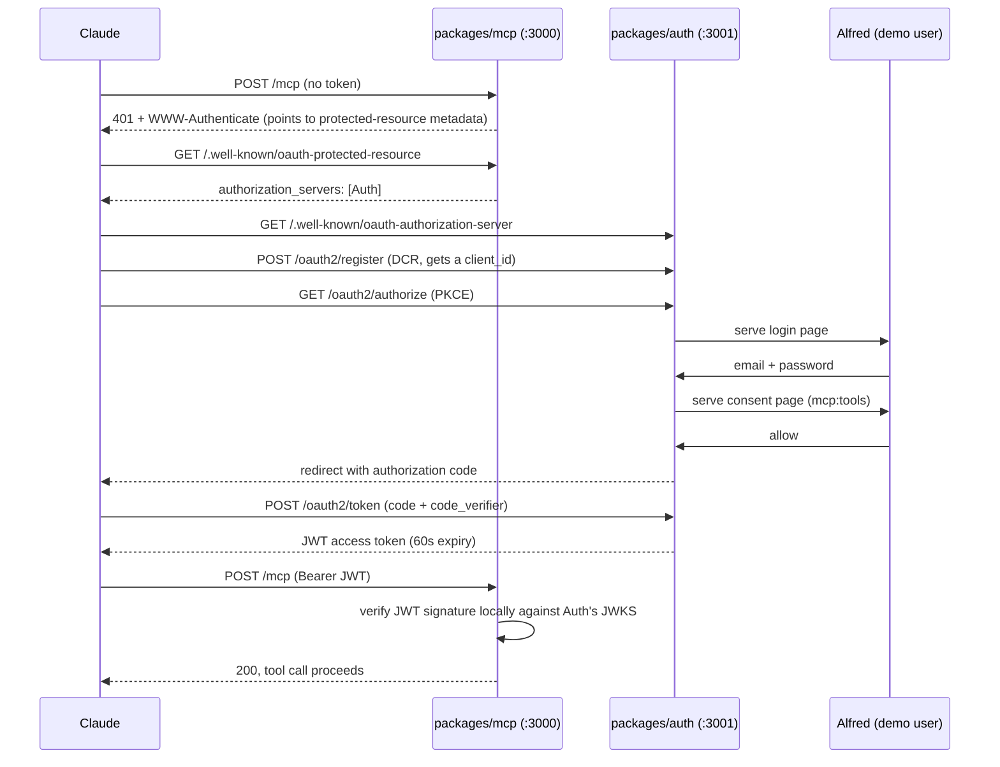

# Auth

`packages/mcp` (the MCP server, `/mcp`) is protected by OAuth 2.1. `packages/auth` is a separate, real authorization server built with Better Auth's `@better-auth/oauth-provider` plugin, not a mock. The whole `/mcp` endpoint requires a valid Bearer token with the `mcp:tools` scope, there is no per-tool authorization.

## Flow

## Key facts

- Token validation is local: `packages/mcp` checks the JWT's signature and claims itself (`verifyAccessToken` against `<AUTH_ORIGIN>/jwks`), it does not call back to `packages/auth` on every request.
- Access tokens expire after 60 seconds on purpose, so "access cut off" is demoable live by just waiting, without needing instant revocation.
- Demo user: `alfred@wayne-enterprises.com` / `IAmBatman!123`, seeded automatically on `packages/auth` startup.
- Auth is opt-in for local dev: `packages/mcp` only enforces the Bearer check when `REQUIRE_AUTH` is true, it's off by default so `pnpm inspect` and quick tool iteration work without a login/consent dance. Set it with the `REQUIRE_AUTH=true` env var, or flip `REQUIRE_AUTH_DEFAULT` in `packages/mcp/src/config.ts` if you don't want to set the env var every time. Always on for the actual demo or for any server reachable from Claude.
